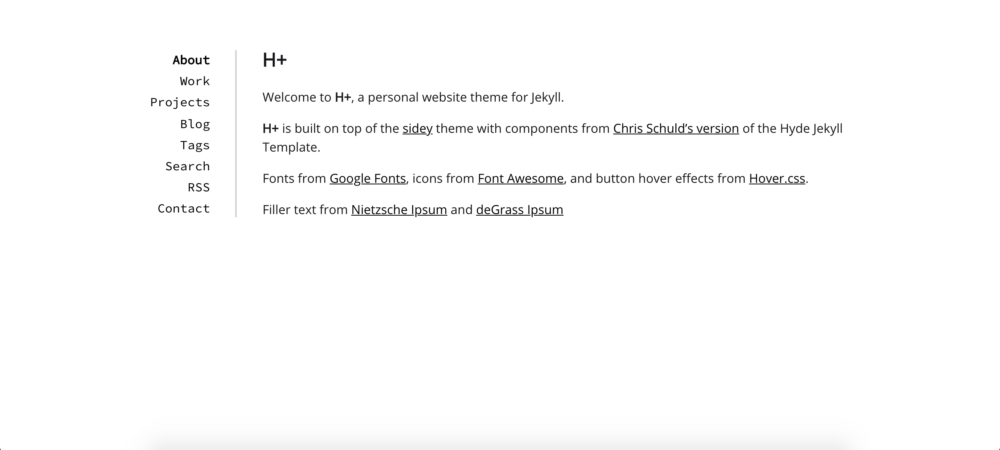
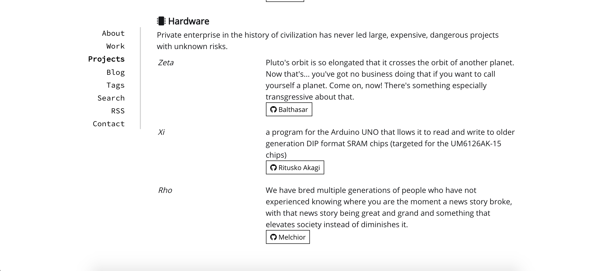
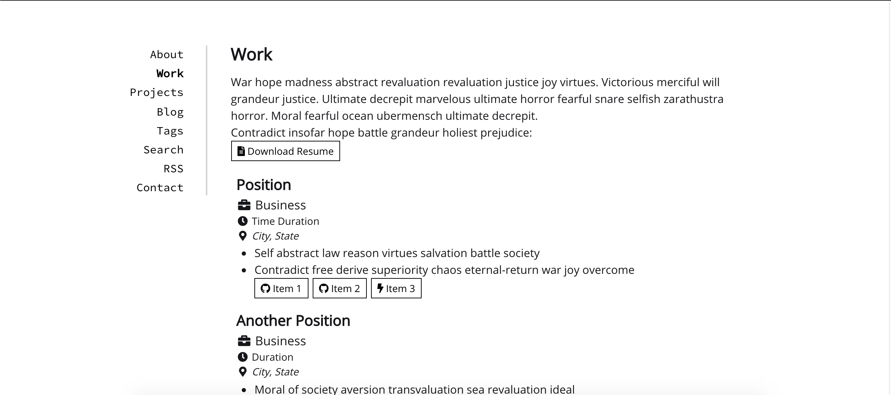

# H+
A simple theme for a personal website, oriented towards developers.





Built on top of the [sidey](https://github.com/ronv/sidey) theme with components from [Chris Schuld's version](https://github.com/cbschuld/chrisschuld.com) of the Hyde Jekyll Template.

Fonts from [Google Fonts](https://fonts.google.com/), icons from [Font Awesome](https://fontawesome.com/), and button hover effects from [Hover.css](https://ianlunn.github.io/Hover/)


## Usage Warning

This theme wasn't originally developed with the intention of being a theme. It was something that I hacked together over a week for my [own personal website](www.johnzl.com). However, I wanted a way to make sure that any edits I made didn't end up breaking pre-existing content, hence my idea to give my "theme" its own repository. Also, there was quite a decent amount of unique clones on that personal website repo, so I assume they were more interested in the theme than my website itself.

The Sass and layouts are somewhat messy but I plan to touch things up as I work towards a cleaner and more streamlined design for my own website.

Everything will still work if you publish to Github pages or use the Jekyll Docker image to load it, the code will just be a bit messier than what you might see in a more dedicated theme.

I encourage you to copy, modify, and grab whatever you need should you find it useful though!

## Note about Tags

The tags used in posts need to be generated separately through a python script that creates a `tags` folder with a markdown file for each tag.

The script should be run from the main website directory, NOT within the script directory.

```
python3 /_scripts/tag_generator.py
```

## Local Development - Live
```
docker run --env=DEBUG=true --rm --volume="$PWD:/srv/jekyll" -p 3000:4000 -it jekyll/jekyll:3.8 jekyll serve -w --force_polling
```

## Local Development - Build for Deployment
```
docker run --env=DEBUG=true --env JEKYLL_ENV=development --rm --volume="$PWD:/srv/jekyll" -p 3000:4000 -it jekyll/jekyll:3.8 jekyll build
```

## License
Open sourced under the [MIT License](LICENSE.md)
